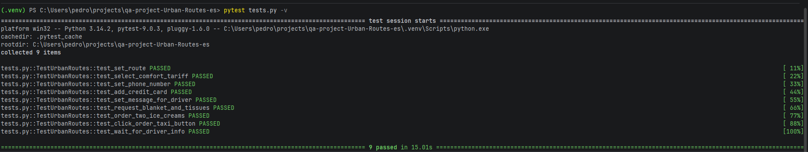
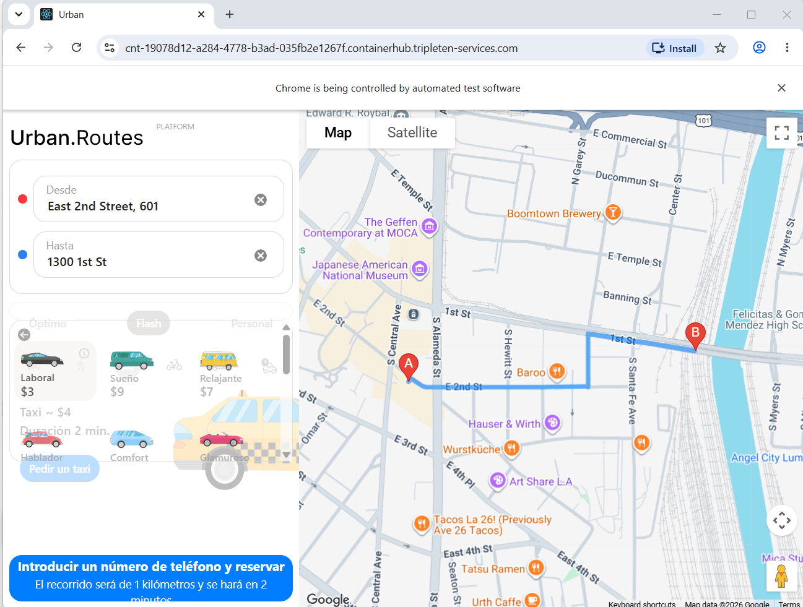
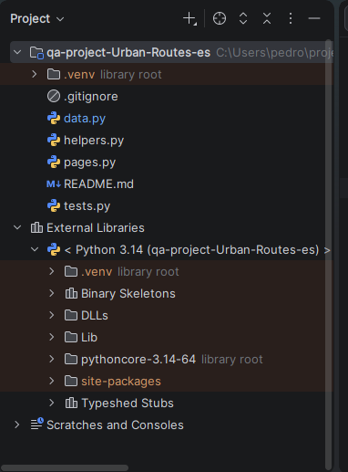
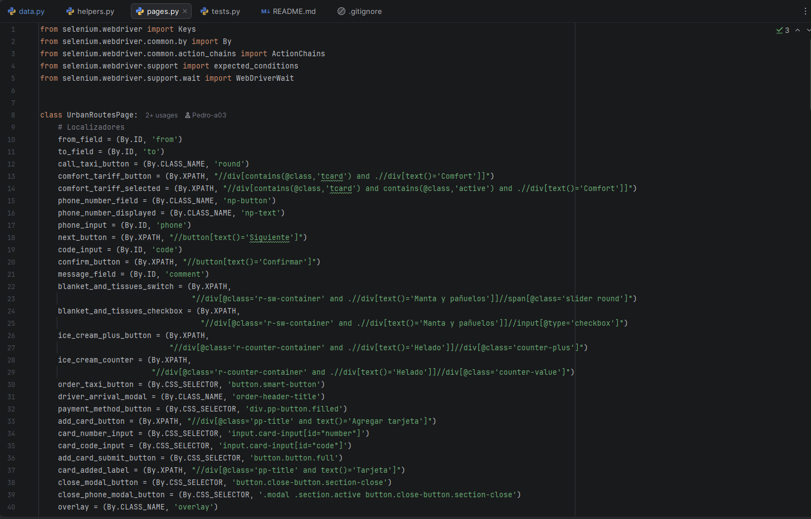

# Urban Routes - QA Automation Project

[](https://www.python.org/)
[](https://www.selenium.dev/)
[](https://docs.pytest.org/)

## 📋 Project Description

This project is the final assignment of Sprint 9 of the QA Engineering bootcamp at TripleTen. The goal is to automate the end-to-end functional testing of **Urban Routes**, a web application that allows users to request taxi rides.

The automated test suite covers the complete user flow of ordering a taxi, including:

- Setting pickup and destination addresses
- Selecting the Comfort fare tier
- Filling in the user's phone number and verification code
- Adding a credit card with CVV confirmation
- Writing a custom message for the driver
- Requesting additional services (blanket, tissues, ice creams)
- Verifying the taxi search modal and driver assignment

The project follows industry-standard QA automation practices, including the **Page Object Model (POM)** design pattern and explicit waits for handling asynchronous page elements.

## 🛠️ Technologies and Tools

- **Programming Language:** Python 3.14
- **Test Automation Framework:** Selenium WebDriver 4.43.0
- **Test Runner:** pytest 9.0.3
- **Browser:** Google Chrome 147
- **Driver Management:** Selenium Manager (automatic ChromeDriver provisioning)
- **Version Control:** Git / GitHub
- **IDE:** PyCharm Community Edition
- **Operating System:** Windows 11

## 🧪 Testing Techniques and Patterns

This project applies the following QA automation techniques:

- **Page Object Model (POM):** UI elements and interactions are encapsulated in `pages.py` (`UrbanRoutesPage`), separating test logic from page structure.
- **Explicit Waits:** `WebDriverWait` combined with `expected_conditions` ensures stable interactions with dynamically loaded elements, avoiding flaky tests.
- **Sequential Test Design:** Tests run in order within a single browser session. Each test executes only its specific action, relying on the state left by the previous test — avoiding repetition of prior steps.
- **Class-level Fixtures:** `setup_class` opens the browser once for all tests; `teardown_class` closes it after all tests complete.
- **W3C Capabilities:** Performance logs (`goog:loggingPrefs`) are enabled via `set_capability` to intercept network responses required for the phone confirmation flow.
- **Network Log Interception:** The `retrieve_phone_code()` helper in `helpers.py` uses Chrome DevTools Protocol (CDP) to capture the SMS confirmation code from API responses.
- **JavaScript Execution:** Used to interact with React-controlled form fields (credit card inputs) and to bypass overlay interference on dynamically rendered elements.
- **ActionChains:** Used to simulate character-by-character keyboard input on form fields that require native keyboard events to trigger React state updates.
- **Overlay Handling:** A dedicated `wait_for_overlays_to_disappear()` method ensures modal overlays are dismissed before interacting with underlying elements.
- **Diverse Locator Strategies:** Tests use multiple Selenium locator types (`By.ID`, `By.CLASS_NAME`, `By.CSS_SELECTOR`, `By.XPATH`) to demonstrate flexible element identification.

## 📁 Project Structure

    qa-project-Urban-Routes-es/
    ├── .venv/                  # Virtual environment (not tracked in Git)
    ├── data.py                 # Test data: URL, addresses, phone, card details
    ├── helpers.py              # retrieve_phone_code() helper via CDP
    ├── pages.py                # UrbanRoutesPage: locators and interaction methods
    ├── tests.py                # TestUrbanRoutes: 9 sequential test cases
    ├── README.md               # Project documentation
    └── .gitignore              # Files excluded from version control

## 🧾 Test Cases

| # | Test | Action | Assert |
|---|------|--------|--------|
| 1 | `test_set_route` | Open app and fill addresses | From/To fields match expected values |
| 2 | `test_select_comfort_tariff` | Click Comfort tariff | Comfort tariff is active |
| 3 | `test_set_phone_number` | Enter phone + SMS code | Phone number displayed on screen |
| 4 | `test_add_credit_card` | Add card via payment modal | "Tarjeta" appears in payment method list |
| 5 | `test_set_message_for_driver` | Type driver message | Message text matches input |
| 6 | `test_request_blanket_and_tissues` | Toggle blanket switch | Checkbox is selected |
| 7 | `test_order_two_ice_creams` | Click + twice | Counter shows "2" |
| 8 | `test_click_order_taxi_button` | Click order taxi button | Driver arrival modal appears |
| 9 | `test_wait_for_driver_info` | Wait for driver info | Modal text is non-empty |

## ▶️ How to Run

1. Clone the repository and activate the virtual environment:
   ```bash
   git clone https://github.com/Pedro-a03/qa-project-Urban-Routes-es.git
   cd qa-project-Urban-Routes-es
   python -m venv .venv
   .venv\Scripts\activate  # Windows
   pip install -r requirements.txt
   ```

2. Update `data.py` with a fresh Urban Routes URL from TripleTen.

3. Run the full test suite:
   ```bash
   pytest tests.py -v
   ```
> ⚠️ Tests are sequential and depend on shared browser state. Always run the full suite with `pytest tests.py`, not individual tests.

---

## 📸 Execution Evidence

Visual proof of successful test execution and project structure.

### ✅ Test Suite Execution — 9/9 Tests Passed



*All 9 sequential test cases passed in a single browser session (17.61 seconds total runtime) using Selenium 4.45 with Chrome 149.*

### 🚖 Browser Automation in Action



*Selenium WebDriver controlling Google Chrome during automated flow execution on the Urban Routes web application.*

### 📁 Page Object Model Structure



*Project organization following the Page Object Model pattern with clear separation of concerns across `helpers.py`, `pages.py`, and `tests.py`.*

### 🎯 Locator Strategy Implementation



*Class `UrbanRoutesPage` demonstrating the 4 locator strategies used across the project: `By.ID`, `By.CLASS_NAME`, `By.XPATH`, and `By.CSS_SELECTOR`.*

## 👤 Author

**Pedro Acosta**

GitHub: [@Pedro-a03](https://github.com/Pedro-a03)
